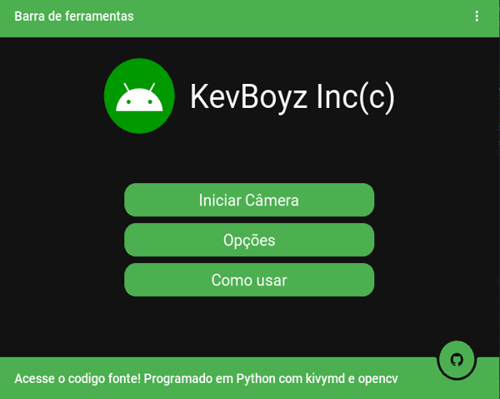

# Sensor de movimento Android
 

This is a simple app developed in Python with kivymd and opencv. The main
function is make a mobile device work as a smart security camera, capturing 
and registering movement. He also has a sqlite database, that works for save 
and update the app config.

If you want to learn more about Kivy and Opencv, I recommend you clone this repo,
to study or just test the app. Sincerely for simpler that be the mobile development
with kivy is some problematic. Try to do a something like this if you want know how 
apps are programed and how python runs on Android. But if you want a better app, you're
going to need learn about an Android native language like hmm, I don't know anyone.

This app can run perfectly on your mobile device, but for this you need compile the code.
Is a long process, and you can receive so many errors while trying this. If you are interesting,
search about how build python to apk with buildozer and try to use this [collab](https://colab.research.google.com/gist/kaustubhgupta/0d06ea84760f65888a2488bac9922c25/kivyapp-to-apk.ipynb)
to build the app. If you can do this, please contact me, the apk going to be available on releases.
